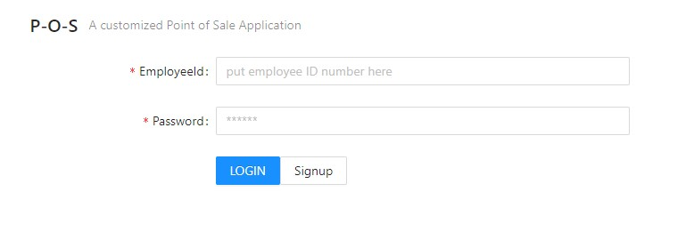
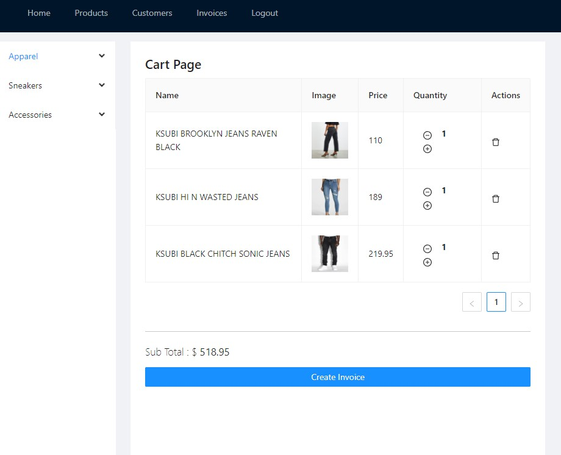
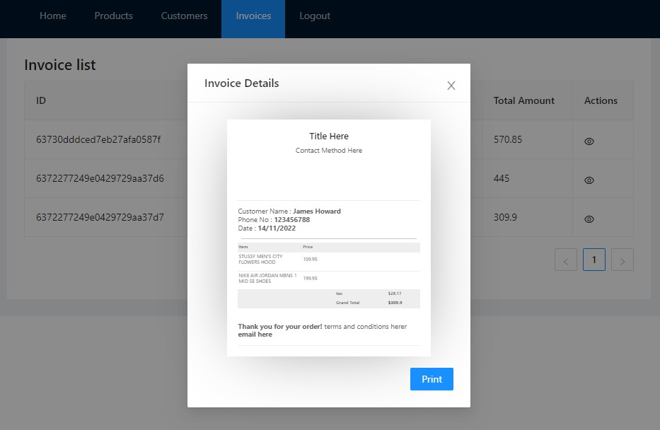
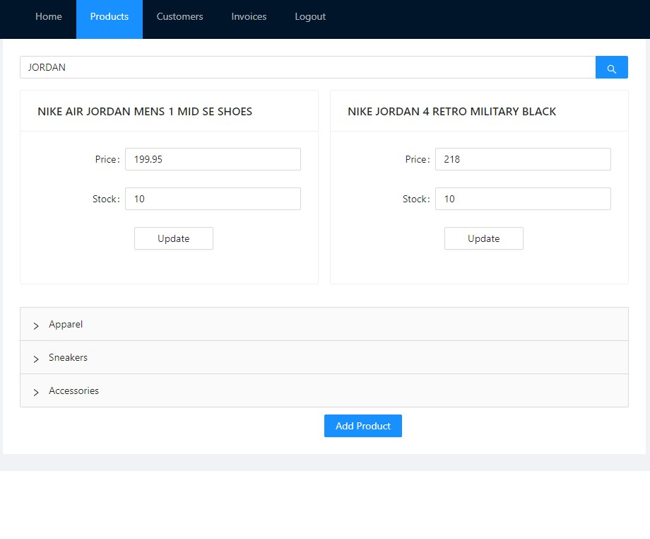

# P.O.S

## Description

     A customized Point of Sale Application

## Technologies used

    - React for the front end
    - Antd with css for page structure and styles
    - MongoDB and Mongoose ODM for the database
    - Use GraphQL with a Node.js and Express.js server
    - Use queries and mutations for retrieving, adding, updating and deleting data
    - React-Redux for state management

## Installation Instrustions

    npm i
    npm run seed
    npm run dev

## Screenshot

    Login Page

    Home/Cart Page

    Invoice Page

    Inventory Page

## Deployed Application

    Use the link below with provided admin combo, you can try our POS application.

        employeeId: "123456",
        password: "password12345",

Click [here](https://guarded-meadow-66403.herokuapp.com/) for the app
